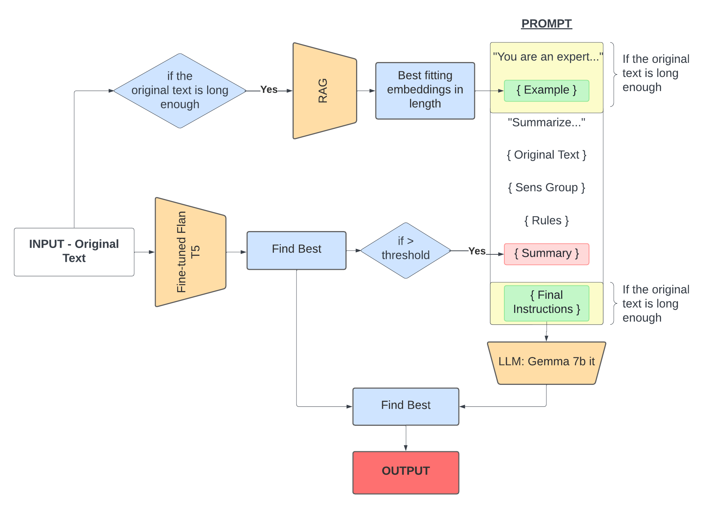

# Hackathon

[](https://stringfixer.com/fr/MIT_license)


[](https://github.com/psf/black)

---
This git repository is a solution to the topic proposed during the Airbus Helicopter hackathon from Thursday 22 February 2024 to Wednesday 28 February 2024. The task is as follows: Automate the summarization of short specialized texts in the legal field.

**Authors :** Eliott CRANCEE, Cléa HAN, Yanis LABEYRIE, Léa TRIQUET, Adrien ZABBAN.

---

## Installation Guide :

### Disclaimer
You won’t be able to run the code because I deleted all the data that were Airbus’s property.

### Installation Requirements
To run the code you need python (We use python 3.10.11) and packages that are indicated in [`requirements.txt`](requirements.txt).
You can run the following code to install all packages in the correct versions:
```sh
pip install -r requirements.txt
python -m spacy download en_core_web_sm
```

### Installation with Anaconda
The requirements are easily installed via Anaconda :
```bash
conda env create -f environment.yml
conda activate summary
```

### Download models weights
Finally, you need to download the models weights.
Create a directory named for the weights :
```bash
mkdir models_weight
cd models_weight
git lfs install
git clone https://huggingface.co/****************
git clone https://huggingface.co/***************
```
*weights are confidentials too*

## Run the code :

```bash
python run.py -g [gemma_weight] -t [t5_weight] -d [jsonfile] -u [use_llm] -o [output_file_path.json]
```

**Here is a description of each parameter:**

-``[gemma_weight]``: This parameter specifies the weight for the Gemma model that will be used in the pipeline. Replace ``[gemma_weight]`` with the desired weights path. The path should be a string.

-``[t5_weight]``: This parameter specifies the weight for the T5 model that will be used in the pipeline. Replace ``[t5_weight]`` with the desired weights path. The path should be a string.

-``[jsonfile] ``: This parameter specifies the path to the JSON file that contains the data to be summarized. Replace ``[jsonfile]`` with the path to your JSON file. It should be a string like ``".\data\original_data\airbus_helicopters_test_set.json"``.

-``[use_llm]``: This parameter specifies whether to use the LLM (more precisely Gemma-7b-it) in the pipeline, or only the T5 model. Replace ``[use_llm]`` with ``True`` if you want to use the LLM, or ``False`` if you want to use only the T5 model.

-``[output_file_path.json]``: This parameter specifies the path where the output JSON file will be saved. Replace ``[output_file_path.json]`` with the desired output file path. It should be a string like ``"test.json"``.

Please replace the placeholders (e.g., ``[gemma_weight]``, ``[t5_weight]``, etc.) with actual values when running the script.

```bash
python run.py -g .\models_weight\gemma_weight\ -t .\models_weight\t5_weight\ -d .\data\original_data\airbus_helicopters_test_set.json -u False -o test.json
```

## Model Architecture :



## Contents :

**Folder ``data`` :**
- ``original_data/``: raw data
- ``data_csv/``: data in CSV format for model training such as BART
- ``data_json/``: data in JSON format for model evaluation
- ``analyse_grammaticale/``: grammatical analysis for summarization rules
- ``xgboost/``: list of summaries for training XGBoost to predict the ``god_metric``
- ``split_data.py``: script to split and format data, resulting in 80% training data and 20% test data
- ``analyse_labels.py``: script to view the distribution of token number in the original text and summaries

**Folder `assets` :**
- ``model.png``: Scheme of the model
- ``One pager Hackatsuki.pdf``: One pager of the Hackatsuki team
- ``Présenation Hackatsuki.pdf``: Presentation slides of the project
- ``Rapport Hackatsuki.pdf``: Project Report


**Folder `src` :**
- `models/`: Contains all the models we use
- `prompt_templates/`: Contains all the prompts we use
- `xgboost/`: Code to train an xgboost that predicts the god metric without the reference summary (only with the original text and the generated summary).

**Folder `results` :**
- `results.csv`: Comparative performance of different tests and models that we have test during the week.

**Folder `evaluation_toolkit` :**
Folder given to us by airbus to evaluate the metrics of the summaries generated

**Folder `ressources` :**
Folder containing list of resources such as deliverables or evaluation criteria

---
## Clone
This Git repository is a clone of the original project. The original contains all the data and model weights, so it is private and you won’t be able to find it.
